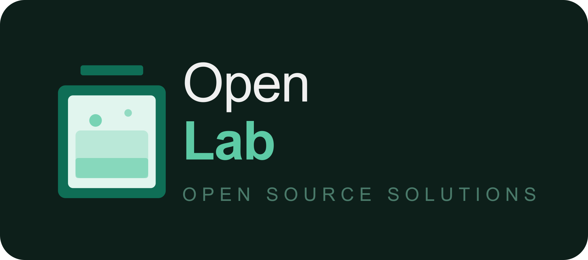

# 🔬 OpenLab

**Laboratório de software open source**

Exploramos, experimentamos e compartilhamos — projetos abertos para a comunidade.

---

## 📖 Sobre o OpenLab

O OpenLab é o portfólio open source de [Patrick Ribeiro](https://github.com/patrickdevbr), Arquiteto de Software. Aqui você encontra projetos reais, experimentos técnicos e soluções que refletem minha trajetória e forma de pensar arquitetura — desde decisões de design até implementações práticas.
Cada repositório conta um pouco sobre os desafios enfrentados, as escolhas feitas e o que aprendi no caminho.

---

## 📄 Licença

Salvo indicação contrária em cada repositório, os projetos do OpenLab são distribuídos sob a licença **MIT**. Consulte o arquivo `LICENSE` de cada projeto para mais detalhes.

---

## 📬 Contato

Dúvidas, sugestões ou quer conversar sobre os projetos?

- 🌐 Site: [openlab.software](https://openlab.software)
- 📧 E-mail: patrickribeiro.rb@gmail.com
- 💼 LinkedIn: [linkedin.com/in/patrickdevbr/](https://www.linkedin.com/in/patrickdevbr/)

---

